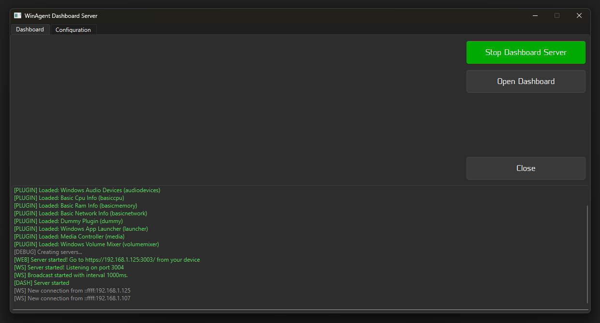
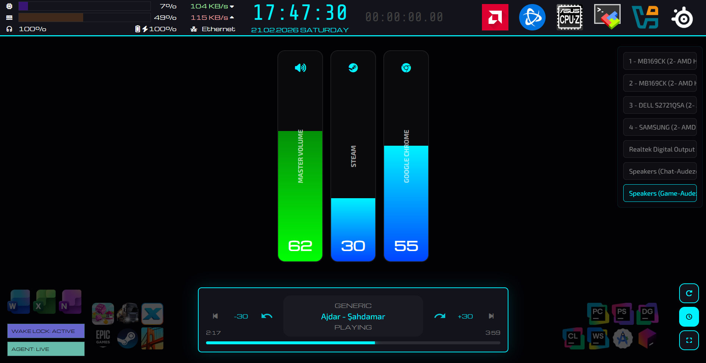

# 🪟✨ WinAgent

<p align="center">
  <b>Open-source Modular Windows monitoring agent (Qt + C++)</b><br/>
  <sub>Loads metric plugins (DLLs), serves a secure dashboard (HTTPS), streams real-time JSON (WSS)</sub>
</p>

<p align="center">
  
  
  
  
  
</p>

---

## 📌 What is WinAgent?

**WinAgent** is a small Windows **host app** that:

- ✅ loads **plugins as external DLLs** (you can extend it without changing the host)
- 🔒 serves a **static dashboard over HTTPS**
- 📡 streams **real-time telemetry as JSON over secure WebSockets (WSS)**

**Idea:** the host stays tiny and stable. New features ship as plugins.

---

## 🧭 Table of Contents

- [✨ Features](#-features)
- [🧱 Project Layout](#-project-layout)
- [⚡ Quick Start](#-quick-start)
- [🛠️ Build (CMake)](#️-build-cmake)
- [🚀 Run & Use](#-run--use)
- [🧩 Plugin System (How it Works)](#-plugin-system-how-it-works)
- [📡 WebSocket Protocol](#-websocket-protocol)
- [🧰 Included Plugins](#-included-plugins)
- [🧑‍💻 Plugin Development](#-plugin-development)
- [🧯 Troubleshooting](#-troubleshooting)
- [📜 License](#-license)

---

## ✨ Features

- 🧩 **Plugin system**
  - Host loads: `plugins/*.dll`
  - Optional per-plugin config: `plugins/<pluginId>.json`
- 🔒 **HTTPS dashboard server**
  - Default port: **3003**
  - Serves static files from: `dashboards/default/`
- 📡 **WSS JSON stream**
  - Default port: **3004**
  - Sends periodic **update** events (default: **1000 ms**)
- 🧰 **CMake build + auto deploy**
  - Copies runtime assets next to the exe (dashboard + certs + dll deps)
  - Runs **windeployqt** automatically (if found)

---

## 🧱 Project Layout

Typical repo layout:

```text
WinAgent/
├─ CMakeLists.txt
├─ main.cpp
├─ include/                 # host headers + plugin ABI (BasePlugin.h)
├─ src/                     # host sources
├─ plugins/                 # plugin projects (each builds a DLL)
├─ dashboards/default/       # static dashboard (HTML/CSS)
├─ certs/                   # default TLS cert/key (self-signed)
└─ lib/                     # 3rd-party runtime (e.g. hidapi*.dll/.lib)
```

---

## ⚡ Quick Start

### ✅ Requirements

- Windows 10/11 (x64)
- **CMake ≥ 3.28**
- **Qt 6.x** with modules:
  - Core, Widgets, Network, HttpServer, WebSockets
- Visual Studio 2022 (MSVC) recommended (or Ninja)

> Tip: Qt is usually provided using `CMAKE_PREFIX_PATH`, like:
> `C:/Qt/6.6.3/msvc2022_64`

---

## 🛠️ Build (CMake)

### 🧰 Option A: Visual Studio (multi-config)

```bat
cmake -S . -B build ^
  -G "Visual Studio 17 2022" -A x64 ^
  -DCMAKE_PREFIX_PATH="C:/Qt/6.x.x/msvc2022_64"
```

Build host + all plugins:

```bat
cmake --build build --config Release --target WinAgent plugins
```

Build only plugins (fast iteration):

```bat
cmake --build build --config Debug --target plugins
```

### ⚙️ Option B: Ninja (single-config)

```bat
cmake -S . -B build-ninja ^
  -G Ninja ^
  -DCMAKE_BUILD_TYPE=Release ^
  -DCMAKE_PREFIX_PATH="C:/Qt/6.x.x/msvc2022_64"

cmake --build build-ninja --target WinAgent plugins
```

---

## 🧨 Build-time Deploy (Post-build steps)

WinAgent’s **CMakeLists.txt** does a lot of work after build. This makes the build folder runnable.

### 📦 1) Runtime output folder

CMake uses:

- `WA_RUNTIME_DIR = $<TARGET_FILE_DIR:WinAgent>`

So assets are copied **next to `WinAgent.exe`**.

### 🔌 2) Copy hidapi runtime files (for HID-based plugins)

CMake looks for files under `./lib/`:

- `hidapi*.dll`
- `hidapi*.pdb` (optional, debug)
- `hidapi*.lib` (optional)

They are copied next to the executable.  
If they are missing, CMake prints a warning.

### 🎛️ 3) Copy dashboard assets

This folder is copied:

- `dashboards/default/` → `<exe_dir>/dashboards/default/`

So the dashboard can be served immediately.

### 🔒 4) Copy TLS certificates

WinAgent needs:

- `certs/cert.pem`
- `certs/key.pem`

By default, CMake copies:

- `./certs/` → `<exe_dir>/certs/`

✅ You can keep certs **outside** the build directory by setting:

```bat
cmake -S . -B build ^
  -G "Visual Studio 17 2022" -A x64 ^
  -DCMAKE_PREFIX_PATH="C:/Qt/6.x.x/msvc2022_64" ^
  -DWA_CERTS_DIR="C:/MyWinAgentCerts"
```

Your folder must contain **cert.pem** and **key.pem**.

### 🚀 5) Auto-run windeployqt (DEV deploy)

On Windows, CMake tries to find `windeployqt` using `CMAKE_PREFIX_PATH` and runs it like:

- Debug → `--debug`
- Release → `--release`

It copies Qt runtime DLLs next to `WinAgent.exe`.  
If it cannot find `windeployqt`, it prints a warning.

Manual run example (PowerShell):

```powershell
& "C:\Qt\6.x.x\msvc2022_64\bin\windeployqt.exe" `
  --release --compiler-runtime --no-translations `
  --dir "build\Release" "build\Release\WinAgent.exe"
```

---

## 📦 Install / Distribution (clean output folder)

CMake also has `install()` rules. You can stage a clean folder like this:

```bat
cmake --install build --config Release --prefix dist
```

Expected output:

```text
dist/
└─ bin/
   ├─ WinAgent.exe
   ├─ dashboards/default/...
   ├─ certs/...
   ├─ plugins/               # plugin DLLs + config .json files
   └─ hidapi*.dll            # if present in ./lib
```

Then run `windeployqt` on `dist\bin\WinAgent.exe` (recommended for sharing).

---

## 🚀 Run & Use

### 🖥️ Start

1) Run `WinAgent.exe` (double click is OK)  
2) The UI shows logs and (by default) starts the servers automatically  
3) Click **Open Dashboard** (or open the URL from the logs)

### 🌍 Dashboard URL (HTTPS)

Default:

- `https://<your-ip>:3003/`

WinAgent prints a URL in the log like:

- `[WEB] Server started! Go to https://192.168.1.10:3003/`

> Browser will warn about a **self-signed certificate** (normal for dev).

### 📡 WebSocket URL (WSS)

Default:

- `wss://<your-ip>:3004`

> On phones/tablets you may need to open the HTTPS page first and accept the cert,
> then the WSS connection works.

### 🔥 Firewall

Allow ports:

- **3003** (HTTPS dashboard)
- **3004** (WSS stream)

---

## 🧩 Plugin System (How it Works)

### 🧠 Mental model

A WinAgent plugin is a **Windows DLL** that:

1) Exports a **small C ABI** (stable function names)
2) Produces a **JSON snapshot** when the host calls `wa_read()`
3) Optionally handles **JSON requests** when the host calls `wa_request()`

At runtime, the host:

- scans `<exe_dir>/plugins/*.dll`
- loads each DLL
- resolves required exports
- creates + starts the plugin
- reads snapshots periodically and broadcasts them

### 📁 Plugin discovery & config

Runtime plugin folder:

```text
<exe_dir>/plugins/
├─ *.dll
└─ <pluginId>.json    (optional)
```

Config file name is based on **pluginId**, which comes from `wa_get_info()`:

- `WaPluginInfo.id` → `"basiccpu"`
- Config file must be: `plugins/basiccpu.json`

If the file does not exist, the host passes `nullptr` config to the plugin.

### 🧱 ABI summary (Host ↔ Plugin boundary)

The ABI lives in: `include/BasePlugin.h`

Required exports (names must match exactly):

```cpp
wa_get_info
wa_create
wa_init
wa_start
wa_stop
wa_destroy
wa_read
wa_request
```

Optional exports (may be no-op):

```cpp
wa_pause
wa_resume
```

Version check:

- `WaPluginInfo.apiVersion` must equal `WA_PLUGIN_API_VERSION` (currently `1`)

### 🧵 Threading (important)

Most plugins in this repo use the helper class **BasePlugin**:

- `onTick()` runs on the plugin **worker thread**
- `onRequest()` runs on the **host thread**

So `onTick()` and `onRequest()` can run at the same time.  
If you share state, you must protect it with a mutex / atomics.

---

## 📡 WebSocket Protocol

### 📤 Server → Client (periodic update)

Every ~1000 ms the server broadcasts:

```json
{
  "event": "update",
  "payload": {
    "timestamp": 1700000000,
    "modules": {
      "basiccpu": { "...": "..." },
      "basicmemory": { "...": "..." }
    }
  }
}
```

- `payload.modules` is the merged snapshots from all loaded plugins.

### 📥 Client → Server (send a command to a plugin)

Send a JSON object like:

```json
{
  "module": "launcher",
  "payload": {
    "cmd": "launch",
    "name": "Calculator"
  }
}
```

WinAgent routes this to:

- `PluginManager::request(module, payload)`
- plugin’s `wa_request()`

If the plugin returns a JSON object, WinAgent sends it back on the socket,
and also triggers an extra update broadcast shortly after.

---

## 🧰 Included Plugins

All plugins are in `plugins/` and build as DLLs.  
These are **done and included in the repo**:

- 🧠 **basiccpu** — instant CPU load
- 🧮 **basicmemory** — instant RAM usage
- 🌐 **basicnetwork** — interface-based RX/TX speeds
- 🎧 **audiodevices** — list audio devices
- 🔊 **volumemixer** — per-app Windows volume mixer
- 🚀 **launcher** — app shortcut launcher
- 🎵 **media** — simple media controller
- 🔋 **audezemaxwell** — Audeze Maxwell battery info (HIDAPI)

### 🗂️ Plugin config examples

Configs live next to DLLs:

- `plugins/basicnetwork.json` supports:
  - `intervalMs`
  - `allowedInterfaces` (empty = all)

- `plugins/volumemixer.json` supports:
  - `intervalMs`
  - `ignoredApps` (list of app/session names)

- `plugins/launcher.json` supports:
  - `intervalMs`
  - `apps` (name/path/icon list)

---

## 🧑‍💻 Plugin Development

Plugin development is documented in:

➡️ **`plugins/README.md`**

That file includes:

- the complete ABI reference
- BasePlugin lifecycle and threading rules
- a copy/paste minimal plugin template
- the CMake pattern used in this repo
- deployment checklist + common mistakes

**Fast steps (high level):**

1) Create a new folder under `plugins/<myplugin>/`
2) Add `Plugin.cpp`, `CMakeLists.txt`, and `config.json`
3) Build:

```bat
cmake --build build --config Debug --target plugins
```

4) Your DLL + config will land here:

```text
<exe_dir>/plugins/<anything>.dll
<exe_dir>/plugins/<pluginId>.json
```

5) Run WinAgent. The host auto-loads it on startup.

---

## 🗺️ Roadmap

Planned improvements:

- [ ] 🔐 Basic auth / token for HTTPS + WSS
- [ ] 👁️ Live watching plugin outputs in the UI
- [ ] ⚙️ Per-plugin config in the UI (edit JSON safely)
- [ ] 🔄 Live controls: start / stop plugins + apply config without restart
- [ ] 🧩 Plugin repository (browse + install plugins from a central place)
- [ ] 🖥️ Multiple dashboards (choose which one to serve)
- [ ] 🧯 Plugin watchdog (plugin auto reset on crash/freeze)
- [ ] 📈 Telemetry history
- [ ] 🔔 Alerts (CPU/RAM/network threshold) + desktop notification / webhook

---

## 🧯 Troubleshooting

### 🔒 “Certificate warning” in browser
Normal for self-signed certs. Use your own certs with `-DWA_CERTS_DIR=...`.

### 🔥 Dashboard does not open on phone
- Same Wi‑Fi network?
- Firewall allows **3003** and **3004**?
- Open `https://<ip>:3003/` first to accept the cert.

### 🧩 Plugin not loading
Checklist:

- DLL is in `<exe_dir>/plugins/`
- Required exports exist (names must match)
- `WaPluginInfo.apiVersion == WA_PLUGIN_API_VERSION`
- `WaPluginInfo.id` is not null
- If you have config, file name matches `<pluginId>.json`

### 🧰 “windeployqt not found”
Make sure Qt `bin/` is reachable:
- set `CMAKE_PREFIX_PATH` to your Qt root
- or run `windeployqt` manually

---

## 📜 License

MIT — see **`LICENCE.txt`**.

---

<p align="center">
  <sub>Made with ❤️ in C++ / Qt • Plugins welcome</sub>
</p>

---

<p align="center">
  
  
  
</p>

---

## 📷 Screenshots

Server:


Client on tablet:

